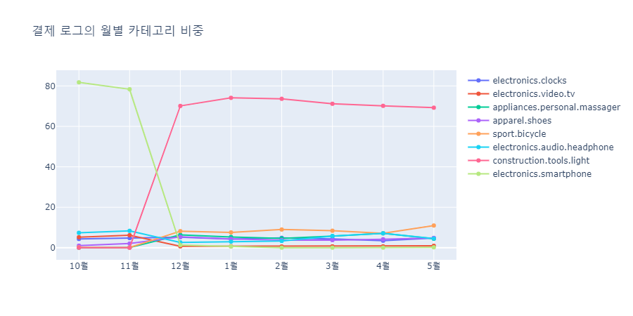
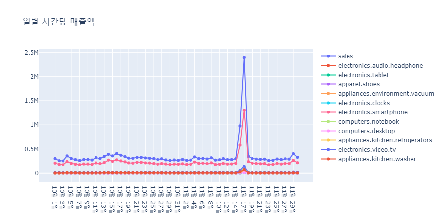
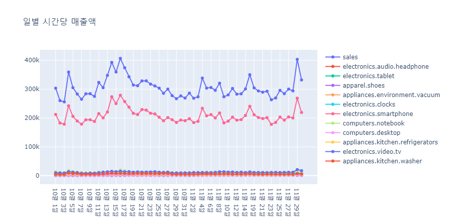
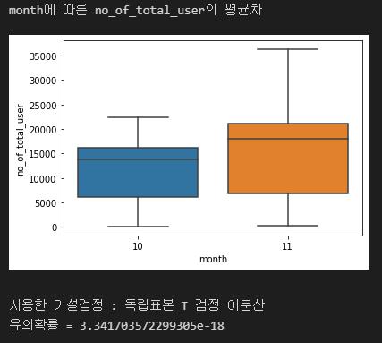
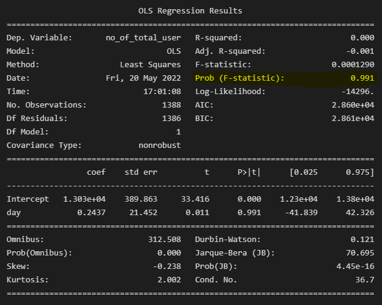

# 데이터 분석

### 사용한 데이터

    
    데이터는 2019년 어떤 E-commerce 의 로그 데이터입니다.
    시간은 GMT+4를 가정하고 분석을 진행했습니다.
    분석에 사용된 데이터는 10월과 11월입니다.

### 10월과 11월만 사용한 이유

    
    12월을 기점으로 전체 구매에서 스마트폰이 차지하는 비중이 급락하고 light가 급등합니다.

    해당 원인을 파악하고자 데이터를 확인해본 결과 12월 이후의 데이터는 로그의 기록에 오류가 있음을 확인했습니다.

    데이터를 신뢰할 수 없으므로 분석에서 사용하지 않습니다.

    해당 근거는 data_problem.ipynb 에서 확인할 수 있습니다.

### 분석 진행 방향  
1. 시간당 접속 유저수의 변화  

        E-commerce 사이트에서 이벤트를 진행한다 가정, 해당 이벤트의 홍보효과를 최대화 하려 합니다.

        홍보효과를 최대화 하기위해 시간당 접속 유저 수가 가장 많은 시간 탐색합니다.

        2019년 10월의 데이터를 표본으로 생각하고 시간당 접속 유저수의 차이에 관해 통계적 가설검정을 실시했습니다.  

2. 시각화를 통한 EDA 

        시각화를 통해 어떠한 카테고리의 상품이 가장 판매나 조회가 많이 되는지 파악했습니다.

### 분석 세부 내용
1. 시간당 접속 유저수의 변화

        분석을 위해 데이터를 가공했습니다.

        데이터 가공과정은 make_time_data_frame.ipynb에서 확인가능합니다.

        사용하는 데이터는 다음과 같습니다.

        

        일별 시간당 매출액을 그래프로 나타내면 다음과 같습니다.

    

        11월 16일을 기점으로 시간당 매출액이 급하게 증가해서 17일에 최고점에 도착합니다.

        특수한 사건에 의해 매출의 증가가 이루어졌다고 판단했습니다. 
        
        추후 분석에 악영향을 미칠 수 있으므로 해당 날자들을 데이터에서 제거했습니다.

        제거 후 다시 그래프를 그리면 다음과 같습니다.

    

        이제 시간당 접속 유저수가 월별로, 날자별로, 시간대별로, 시간별로, 요일별로 다른가 통계적 가설검정을 실시합니다.

    1. 10월과 11월의 시간당 접속유저수의 평균은 다른가?

        

        귀무가설 : 10월과 11월의 시간당 접속 유저수의 평균은 같다.
        대립가설 : 10월과 11월의 시간당 접속 유저수의 평균은 다르다.
        
        유의확률이 0에 가까운 값이 나왔습니다. 귀무가설을 기각합니다.
        
        11월의 시간당 접속 유저수의 평균이 10월의 시간당 접속유저수의 평균과 다릅니다.

    2. 날자에 따른 시간당 접속유저수의 평균에 추세가 나타나는가?
    

            날자에 따라 분산분석을 실시하면 독립변수의 범주가 너무 많이져서 해석에 있어 직관성을 잃을수 있습니다. 

            따라서 추세가 존재하는가 단순선형회귀를 통해 확인했습니다.

            귀무가설 : 회귀계수는 0이다. (날자에 따라 시간당 접속유저수는 선형적인 추세가 없다.)

    

        회귀선에는 선형적인 추세가 없어보입니다.

        statsmodels 모듈을 통해 해당 회귀선의 유의성 검정결과를 확인해보면 다음과 같습니다.

        

        회귀계수의 유의성검정의 유의확률이 0.991입니다.
        
        따라서 날자에 따른 시간당 접속유저수의 평균에는 선형적인 추세가 나타나지 않습니다.
        
