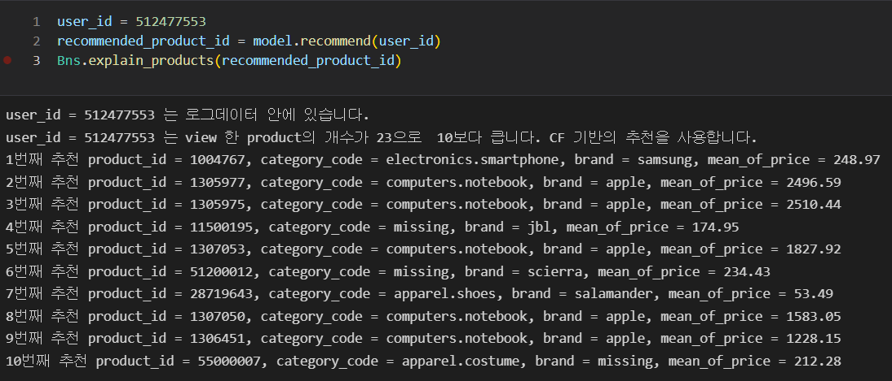
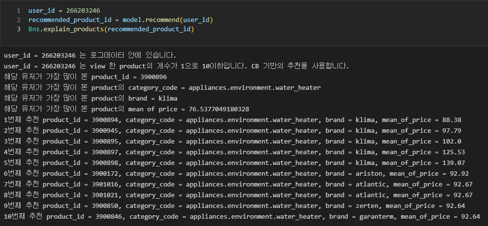
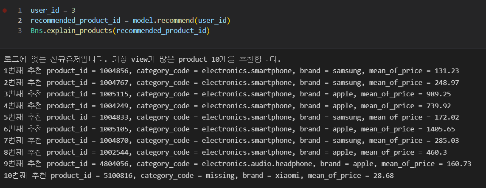

# Basic Usage  
```python
import Bns  

model = Bns.Bns()

model.fit(DATA_PATH)

recommend = model.recommend(user_id)

explain_products(recommend)
```

DATA_PATH : 로그데이터의 위치 ex) "../data/2019-Oct.csv"

explain_products 를 통하여 추천받는 상품 10개의 정보를 확인할 수 있습니다.

## Test Case

### 유저가 조회한 상품의 종류가 11개 이상으로 CF모델을 사용하는 경우

<br>

    플랫폼 내 데이터가 충분한 유저(조회제품 10개이상)일때 비슷한 패턴의 유저들이 조회한 제품을 추천 진행

<br>

### 유저가 조회한 상품의 종류가 10개 이하로 CB모델을 사용하는 경우

<br>

    플랫폼 내 데이터가 충분하지 않은 유저(조회제품 10개 미만)일때 가장 많이본 제품을 기준으로 카테고리, 브랜드, 가격 순으로 가까운 제품 추천이 진행

<br>

### 유저가 조회한 기록이 없는 신규유저의 경우 가장 조회수가 높은 상품을 추천하는 경우

<br>

    데이터가 없는 신규유저이기에 플랫폼 내 조회수를 기반으로 제품을 추천하는 모습

