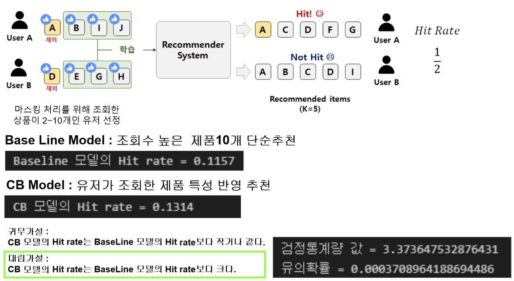
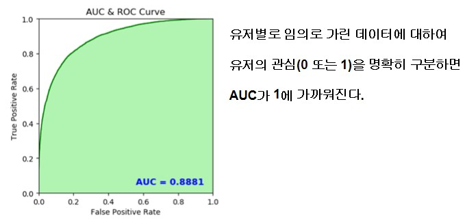
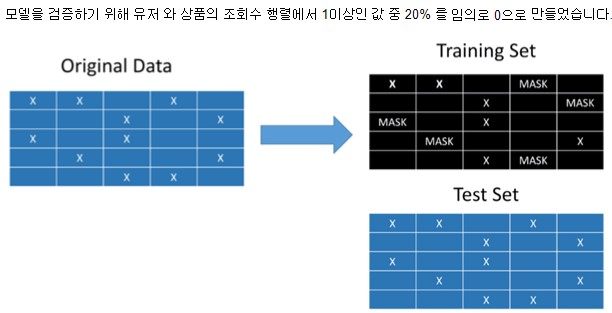
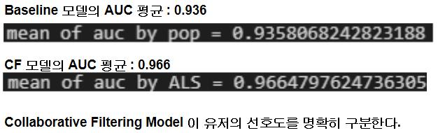

# 추천 모델의 성능 평가

## 구성 파일
    evaluation_of_model_by_ALS.ipynb : 협업 필터링 모델의 성능평가(AUC score)
    evaluation_of_model_by_cb.ipynb  : 콘텐츠 기반 필터링 모델의 성능 평가(Hitrate)
 

## Contents Based model의 평가
CB 모델은 해당 유저가 조회한 상품이 10개 이하일때 적용하는 모델입니다.  
성능평가지표로는 Hitrate를 사용했습니다.  

유저별로 조회한 상품중 하나를 Random 하게 조회하지 않았다고 만들고 해당 상품이 우리가 추천한 상품 10개중 포함이 되면 Hit 입니다.

성능평가를 위한 baseline model은 유저와 관련없이 일괄적으로 가장 조회수가 높은 상품 10개를 추천해주는 모델입니다.

총 유저가 1177302명입니다 해당 유저마다 10개씩 추천해주고 Hitrate를 계산하는데는 연산시간이 부족합니다.   
따라서 임의로 1만명을 표본추출해서 Hitrate를 모비율의 차이검정을통해 baseline model보다 뛰어난 모델인지 확인했습니다.

    귀무가설 : cb 모델을 사용하는것의 정확도와 가장조회수가 높은 것을 추천하는것의 정확도보다 작거나 같다.
    대립가설 : cb 모델을 사용하는것의 정확도가 가장조회수가 높은 것을 추천하는것의 정확도보다 크다.
 
유의확률은 0.0003 입니다. 유의수준 0.01에서도 귀무가설을 기각할 수 있습니다.  
따라서 cb 모델을 사용하는것의 정확도가 가장조회수가 높은 것을 추천하는것의 정확도보다 크다고 할 수 있습니다.

---

## Collaborative Filtering model의 평가
CF 모델은 해당 유저가 조회한 상품의 종류가 11개 이상일때 적용하는 모델입니다.
 
성능평가지표로는 AUC의 평균을 이용했습니다.  

 
유저별로 상품의 조회수를 나타낸 행렬에서 임의로 20%의 0이 아닌 데이터를 0으로 만들고 해당 행렬을 training set으로 이용했습니다.

test set은 유저별로 상품의 조회수를 나타낸 행렬에서 0 보다 큰 값을 1로 바꾸어 이진데이터로 만들었습니다.

성능평가를 위한 baseline model은 해당유저의 관심(0 또는 1)을 해당 제품의 조회수 합으로 예측하는 모델입니다.

즉, 해당 문제를 이진데이터 분류의 문제로 치환한 경우입니다.  
따라서 각 유저마다 AUC를 계산할 수 있으며 모든 유저에 대해 AUC를 구해서 평균을 낸 결과는 다음과 같습니다. 
 

CF모델을 통하여 예측하는 경우가 유저의 관심을 더 명확하게 분류한다고 할 수 있습니다.

